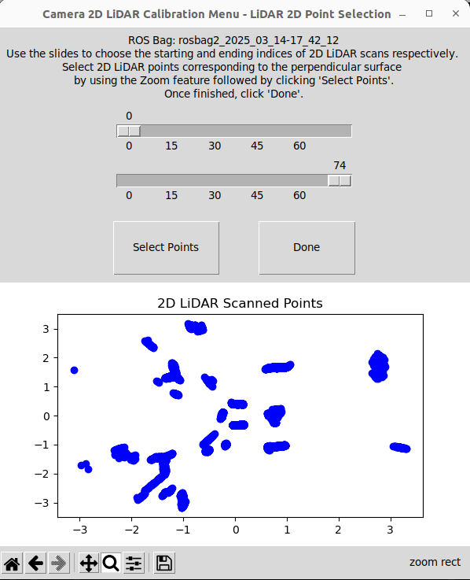
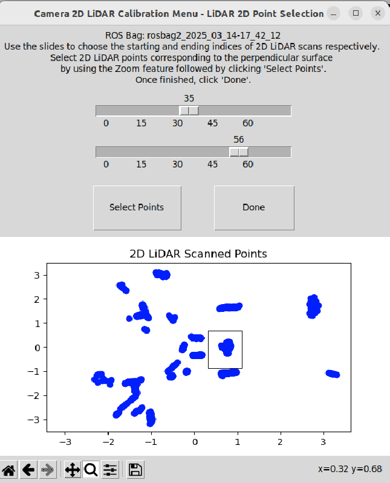
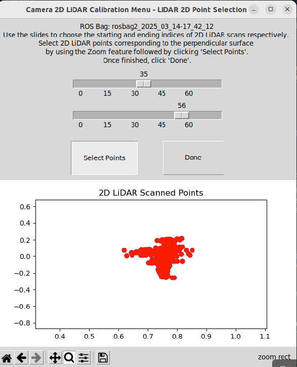
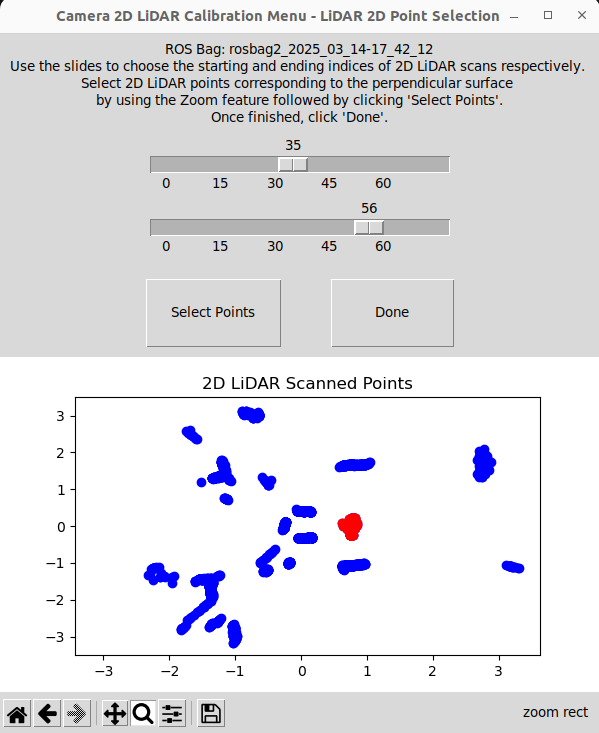
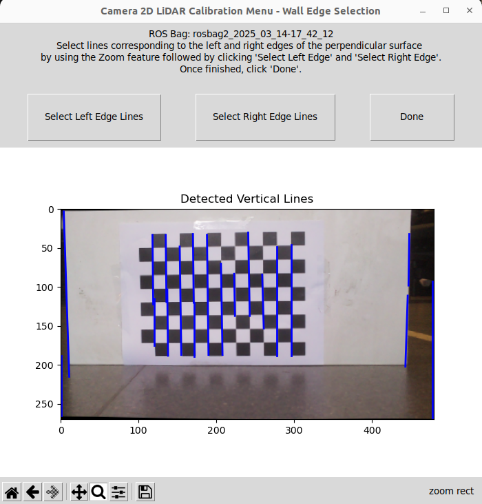
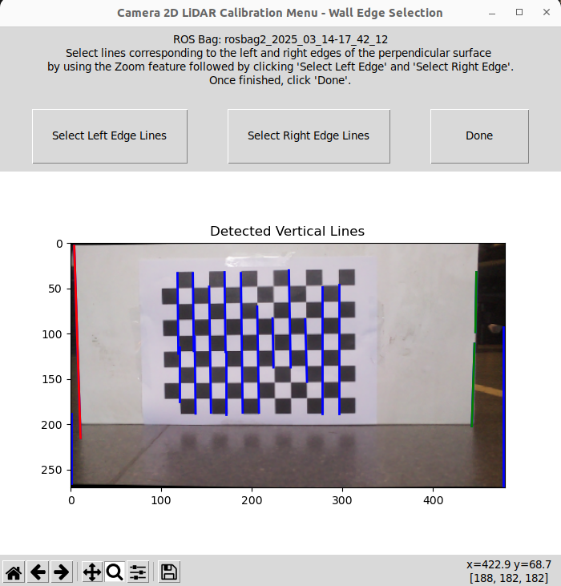
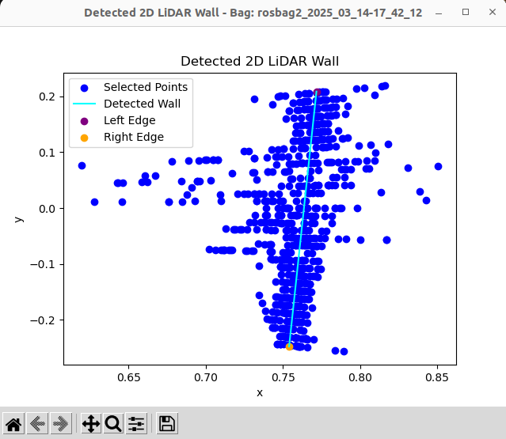
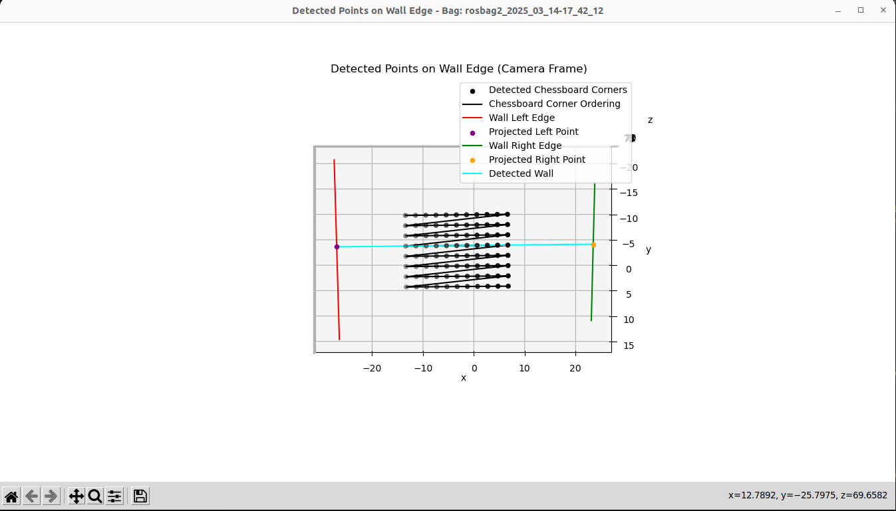
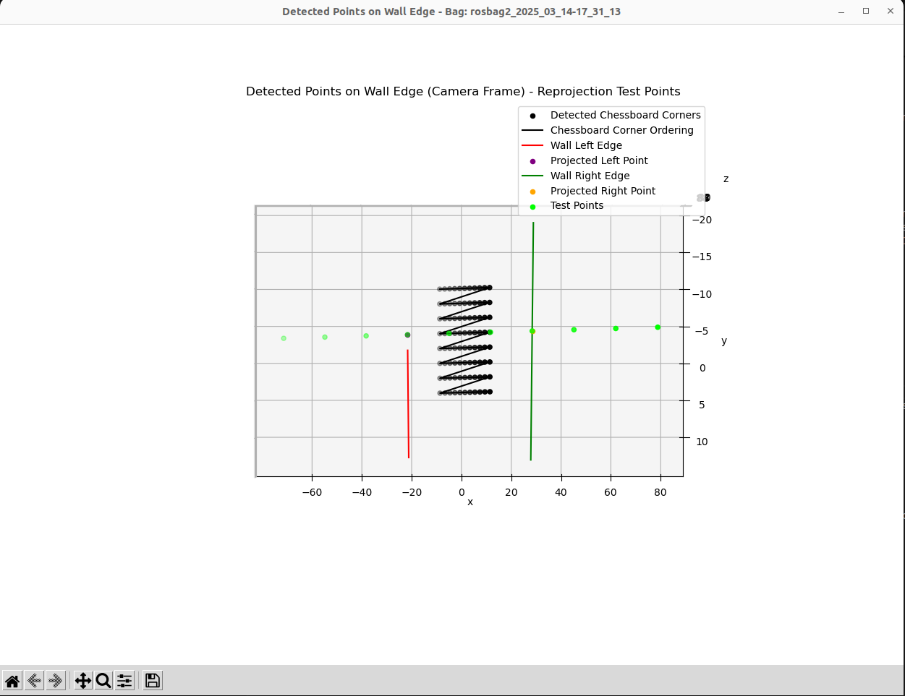
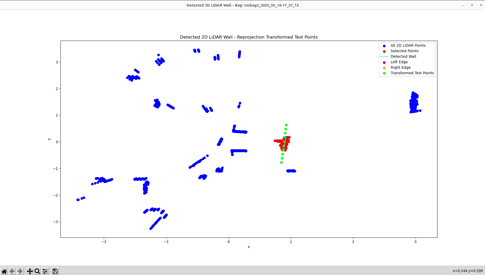

# Camera 2D LiDAR Calibration Library

This is a camera and 2D LiDAR calibration library that computes the SE(3) transformation from the camera frame to the 2D LiDAR frame. 

## Assumptions and Environment Setup

This calibration method relies on the following environment setup and assumptions:

1. A square chessboard pattern is within full-view of the camera, and supported by a wall with straight edges. A copy of this chessboard is provided in `chessboard.pdf`. The software does not necessarily require the dimensions of the wall,  but it needs dimensions of the chessboard; specifically the chessboard square's sizes and the total number of squares.
2. Corners on the chessboard will be used to determine the horizontal direction. Any line defined by a row of corners should be parallel with the ground plane and orthogonal to the edges of the wall.
4. The chessboard is orthogonal to the ground plane.
5. The LiDAR is scanning the world in a plane that is parallel to the ground. The LiDAR can be placed at any height, so long as its rays intersect with the wall.
6. The left and right edges of the wall should be visible in the calibration image, and are discernible from the surroundings.
7. Images from the camera are not flipped, i.e. the images are oriented such that the left/right sides of the wall appear in the left/right sides of the image respectively.
8. The LiDAR scans, when viewed from the top, are oriented so that ordering of wall sides agree with the camera, i.e. left and right.

To see a typical example that satisfies the assumptions above, refer to the following image corresponding to TurtleBot3 Burger. Its 2D LiDAR is located at the top of the robot and scans the world in a plane parallel to the ground.

<p align="center">

</p>

In this example, both the chessboard and the left/right edges of the wall are within full-view.

<p align="center">


</p>

<p align="center">
Camera POV (left) and RViz2 Visualisation of LiDAR Scans (right). In the LiDAR scans, the bottom three sharp lines correspond to the boxes, and the top line corresponds to the wall.
</p>

## Calibration Routine

After setting up the environment, the following routine will produce the required ROS bags that will be fed into the library.

1. Obtain the intrinsic and distortion parameters of the camera through any standard camera calibration method. Ensure the units of these parameters agree with the units of the chessboard.
2. Setup the camera in an environment where you can recognise some features or structure in the LiDAR data (e.g. the boxes surrounding the TurtleBot in the picture above). This setup will assist in the calibration process later.
3. Move either the camera or the wall and chessboard to a different position, ensuring that the left and right edges of the wall and chessboard are visible in the camera, and record a bag of approximately 10-20 seconds.
4. Repeat step 3 for 5 to 10 times.
5. Place the recorded bags in `~/ros2_ws/src/camera_2d_lidar_calibration/bags/`.
6. Replace the `camera_intrinsic_matrix` and `distortion_coefficients` in `~/ros2_ws/src/camera_2d_lidar_calibration/config/params.yaml` with your camera's intrinsic and distortion parameters respectively. Similarly, replace `chessboard_square_size` with the physical size of the chessboard's square in units that agree with the camera intrinsic matrix and distortion coefficients, and replace `chessboard_inner_width` and `chessboard_inner_height` according to the definitions used by OpenCV's [camera calibration library](https://docs.opencv.org/4.x/d4/d94/tutorial_camera_calibration.html).
7. Install and run the camera and 2D LiDAR calibration pipline using the steps below.


## Installation

To install, run the following code:

```
cd ~/ros2_ws/src
git clone https://github.com/sepehrsaryazdi/camera_2d_lidar_calibration.git
cd camera_2d_lidar_calibration
pip install -e . # install python dependencies
cd ~/ros2_ws
colcon build --packages-select camera_2d_lidar_calibration # build ROS dependencies
source install/setup.bash
```

## Running

Ensure that the `$HOME` path variable is set correctly and run the following:

```
ros2 launch camera_2d_lidar_calibration camera_2d_lidar_calibration.launch.py
```

After running, an interface will appear with instructions on selecting 2D LiDAR points that represent the wall containing the chessboard pattern. Note that the interface appears for one ROS bag at a time, and all 2D points of the LiDAR for each bag are accumulated for each interface. To select the points, first change the sliders that control the starting and ending indices of scans from the ROS bag to desired values. Then, use `matplotlib`'s zoom feature, enabled by default, to zoom into a particular region and click `Select Points`. Once finished, click `Done` and repeat this for the other ROS bags. To see this process, watch the video below.

<div align="center">
  <video src="https://github.com/user-attachments/assets/df4e08ce-69d7-43a9-893b-6d8d50af472e" width="400"></video>
</div>


<p align="center">


</p>

<p align="center">


</p>

After selecting the 2D  scans, another interface will appear to match the 2D LiDAR points with the camera frame for each ROS bag. This interface will contain the relevant instructions on selecting vertical lines that correspond to the edges of the wall, and works similarly to the previous interface. In the current implementation, at least one endpoint of each vertical line must be in the zoomed window to be selected.

<p align="center">


</p>

After following these instructions, plots will appear for each bag that represent the fitted lines corresponding to the wall.

<p align="center">


</p>

As a sanity check, a set of test points from the camera frame are projected into the LiDAR frame.

<p align="center">


</p>

The resulting calibration is saved in `~/ros2_ws/src/camera_2d_lidar_calibration/results/camera_2d_lidar_calibration_result_{timestamp}/camera_2d_lidar_calibration_transformation_result_{timestamp}.txt`, alongside any relevant data. 

Evidently, the transformed points are close albeit can differ from any individual ROS bag. Recording more ROS bags and selecting the LiDAR points more carefully will improve the accuracy.

## How It Works

After selecting the 2D LiDAR points, the RANSAC algorithm from scikit-learn (https://scikit-learn.org/stable/auto_examples/linear_model/plot_ransac.html) is used to robustly find the wall line when outliers can exist. This can fail if the gradient is infinite, so the axis with smallest range is used as the dependent variable.

The vertical edges are found using a Probabilistic Hough Transform, followed by a filtering by the line's gradient to select the candidate vertical lines. After selecting the lines, the first principal component is computed using singular value decomposition, which computes the line that minimises the L2-norm to all lines' endpoints. This new line is used as a single representative for a vertical edge of the wall.

After computing the vertical edges, the centre horizontal line of the chessboard is extended in the camera frame until it intersects the two planes spanned by each vertical edge and the normal vector of the chessboard. With this procedure, the camera frame positions of the edges of the wall are heuristically estimated using the vertical lines.

After finding these two positions of the wall's edges in the camera frame and the LiDAR frame, this forms two correspondences between the frames. Computing these correspondences across all ROS bags, the SE(3) transformation and scaling is computed using `cv2.estimateAffine3D(wall_edge_camera_frame_points, wall_edge_lidar_points, force_rotation=True)`.

