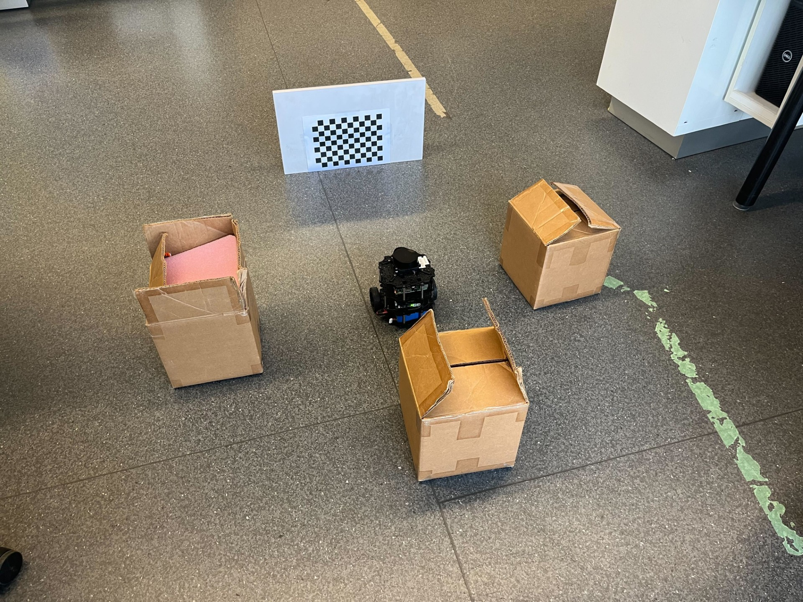
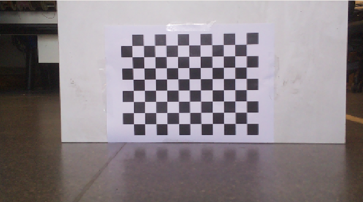
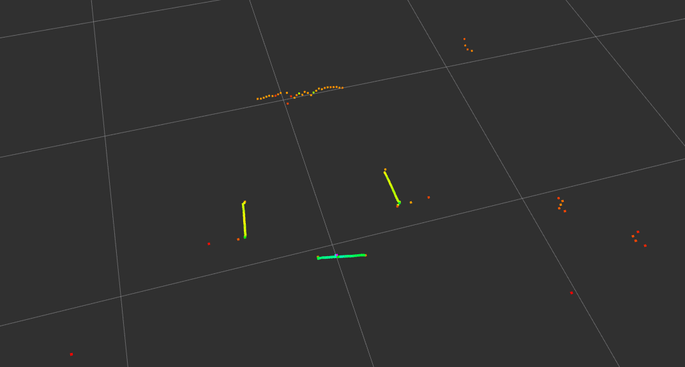

# Camera 2D LiDAR Calibration Library

This is a Camera and 2D LiDAR calibration library that computes the SE(3) transformation from the camera frame to the 2D LiDAR frame. This calibration method relies on the following assumptions:

1. A full square chessboard pattern with known real-world square size and number of squares is within full-view of the camera.
2. The LiDAR is scanning the world in a plane that is parallel to the ground.
3. The chessboard is placed perpendicular to the ground, and is oriented horizontally along its width, with its lowest portion parallel to the ground.
4. The chessboard is supported by a wall with straight edges that are in-view of the camera and discernible from the surroundings.
5. The camera is oriented such that the left/right sides of the wall appears in the left/right sides of the image, respectively.
6. The LiDAR scans are oriented so that ordering of wall sides agree with the camera, i.e. left and right.

To see a typical example that satisfies the assumptions above, refer to the following image corresponding to Turtlebot3 Burger. Its 2D LiDAR is located at the top of the robot and scans the world in a plane parallel to the ground.

In this example, both the chessboard and the edges of the wall are within full-view.

